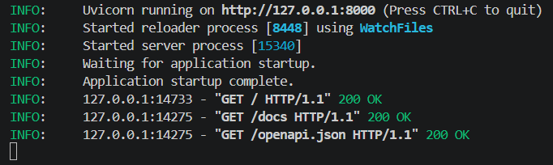
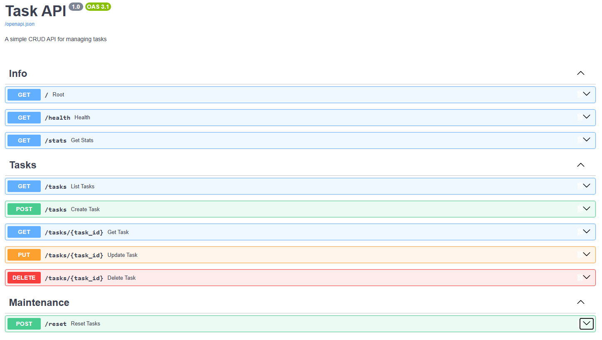

# FlyRank Backend Track - Week 2 CRUD API

A lightweight, in-memory RESTful API built with Python and FastAPI to manage a to-do list.

**Author**: Md. Shahat Akash
**Contact**: shahat.akash@gmail.com

## Installation & Running the Server

To start the server locally, you will need Python 3.10+ installed. Run the following documented command:

```bash
pip install fastapi uvicorn && uvicorn main:app --reload
```

## Snapshot of the outputs:




